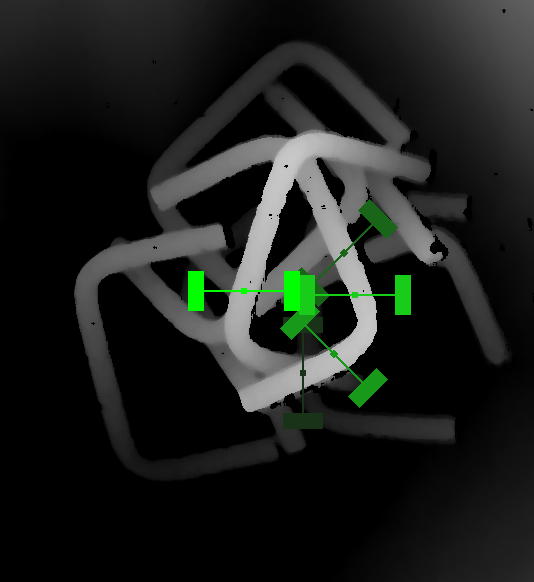

# Fast Graspability Evaluation

Python and C++ code for fast graspability evaluation

Paper: Domae et al., Fast graspability evaluation on single depth maps for bin picking with general grippers, ICRA 2014, 
[PDF](https://www.merl.com/publications/docs/TR2014-065.pdf)



## Usage

Clone this repository. Detect collision-free grasps for a test image in `fast-graspability-evaluation/data/depth.png`

1. Python

```
cd fast-graspability-evaluation/python
python run_graspability.py
```

2. C++
```
cd fast-graspability-evaluation/cpp
mkdir build && cd build
cmake ..
make
./run_graspability
```